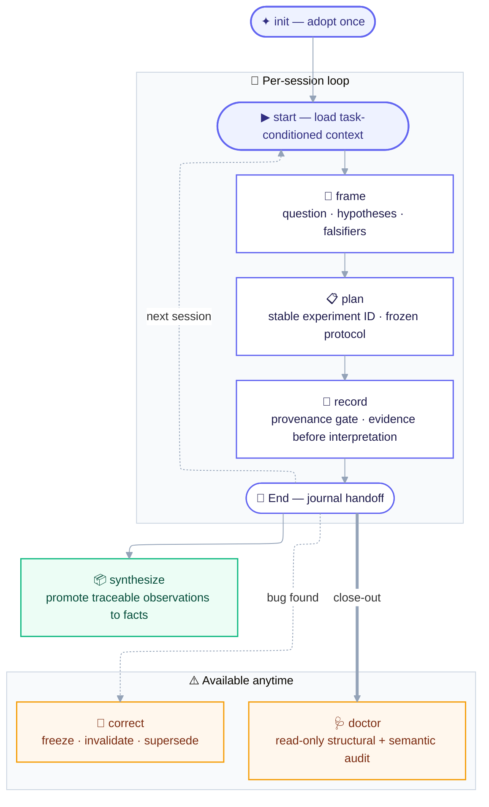
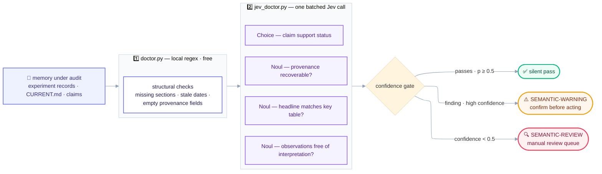

# Project Context V2

**English** | [简体中文](README.zh-CN.md)

Evidence-first, long-term experiment memory for AI coding agents. Every claim stays traceable from question to evidence, every session resumable without archaeology.

Research projects rarely die because results are lost — they die because their *context* is: which config produced that number, why this baseline, what was invalidated, what was merely hypothesized. This skill turns an AI agent (Claude Code, ZCode, any skills-compatible agent) into a disciplined lab-notebook keeper: 10 operations, a controlled validity vocabulary, provenance gates, and read-only audits.

## How it works



### How Jev audits your memory



**Why a decision model for audits?** Every audit question is a small, closed-vocabulary judgment — exactly the shape a non-generative "System One" model is built for:

- **One batched call per audit** — all questions across all records go out in a single request (the quickstart triage measured 425 input tokens), instead of the main model re-reading every record in full.
- **Calibrated confidence, free routing** — every answer carries a probability distribution and a confidence score, so findings split automatically into *silent pass / warning / manual review*, with no prompt-engineering to squeeze uncertainty out of an LLM.
- **Closed vocabulary, no invented findings** — answers are constrained to the schema (`supported / partially-supported / unsupported / invalidated`), so the pre-screen can only flag, never fabricate.
- **Consistent, loggable, tunable** — the same schema runs every time: log Jev's verdicts next to your own reviews and tune thresholds per project.
- **The main model remains the judge** — Jev only triages; every warning and every low-confidence item routes to your review. Without a key, the same checks run on the main model (fallback above).

## Operations

| Operation | Purpose | Mutation |
|---|---|---|
| `init` | Initialize the memory structure (missing files only) | write |
| `start` | Resume: task-conditioned context load + state report | read-only |
| `frame` | Research question, hypotheses, falsifiers, confounders | write (confirmed) |
| `plan` | Register experiment: ID, frozen protocol, acceptance criteria | write |
| `record` | Evidence + provenance gate + key tables | write |
| `end` | Journal handoff, refresh CURRENT, run doctor | write |
| `correct` | Freeze old record, scope the invalidation, link replacement | write |
| `synthesize` | Promote traceable observations into durable facts | write |
| `claim-audit` | Claim–evidence matrix with support classification | read-only |
| `doctor` | Structural + optional semantic health audit | read-only |

## Install

Requires Python ≥ 3.10 for the scripts (zero third-party dependencies).

```bash
# via the skills CLI (project-level; add -g for global)
# interactive: you will be asked which of your agents to install to
npx skills add poiuyjie/jev_project_context
# non-interactive (CI, scripts): name the target agent explicitly
npx skills add poiuyjie/jev_project_context --agent claude-code -y

# or copy the folder into your agent's skills directory
git clone https://github.com/poiuyjie/jev_project_context ~/.agents/skills/project-context-v2
```

Then, inside your research project, tell your agent:

> initialize research memory for this project

Daily use: *"continue this project"* (start), *"record the results of E2026-0922-01"* (record), *"close the session"* (end).

### Optional Jev layers

Two scripts become active once `TYPESAFE_API_KEY` is configured. The simplest way is a `.env` file:

```bash
cp .env.example .env   # then paste your key from https://console.typesafe.ai/keys
```

`jev_client.py` loads `.env` from the current directory, the `scripts/` directory, or the skill root — no dependencies, and real environment variables always take precedence. `.env` is git-ignored: never commit a real key.

With the key in place (see [TypeSafe/Jev docs](https://docs.typesafe.ai)):

- `jev_context.py` — task-conditioned context triage for `start`: ranks experiment records, knowledge entries, protocols, and journals against the current task in one batched decision call, and prints a `LOAD / SKIP` manifest under a character budget. Relevance never hides staleness: `SURFACE` validity warnings (invalidated/superseded evidence) are printed even for skipped items.
- `jev_doctor.py` — semantic pre-screening for `doctor` / `claim-audit` / `synthesize`: provenance recoverability, headline-vs-table consistency, interpretation leaking into observations, and claim-support classification over the controlled vocabulary.

Both are read-only and advisory: findings are triage, never verdicts. Without a key (or on API failure) the scripts print a fallback note and exit 0 — nothing breaks, and every judgment falls back to your agent's main model: the skill's workflows instruct the agent to run the same semantic checks itself and to load context via the fixed reading order. This is a *fallback*, not a *degradation* — quality is backed by the main model (arguably stronger), only cost and latency return to the plain-LLM baseline.

## Memory layout

```text
project/
├── AGENTS.md / CLAUDE.md    # operational entry
├── CURRENT.md               # authoritative present-state projection
├── EXPERIMENTS.md           # compact registry and decisive tables
└── docs/
    ├── protocols/           # versioned evaluation protocols
    ├── research/            # questions, hypotheses, claims
    ├── knowledge/           # facts, bugs, decisions, patterns
    ├── experiments/         # one evidence record per experiment ID
    └── journal/             # session handoffs
```

Schemas for every file: [references/schemas.md](references/schemas.md).

## Core principles

1. **Evidence outlives interpretation.** Observations are recorded before interpretations; a correction replaces the analysis, never the record.
2. **Completed ≠ valid.** Execution state and evidence validity are separate axes; runs start `unchecked`.
3. **Provenance before analysis.** Command, resolved config, code revision, split, seed, protocol — unrecoverable fields are marked `unknown`, never backfilled from current defaults.
4. **Never rewrite history silently.** Invalidated results stay visible with warnings and bidirectional `supersedes/superseded_by` links.
5. **Audits are read-only.** `doctor` and `start` never mutate; Jev findings are advisory only.

## License

[MIT](LICENSE)
