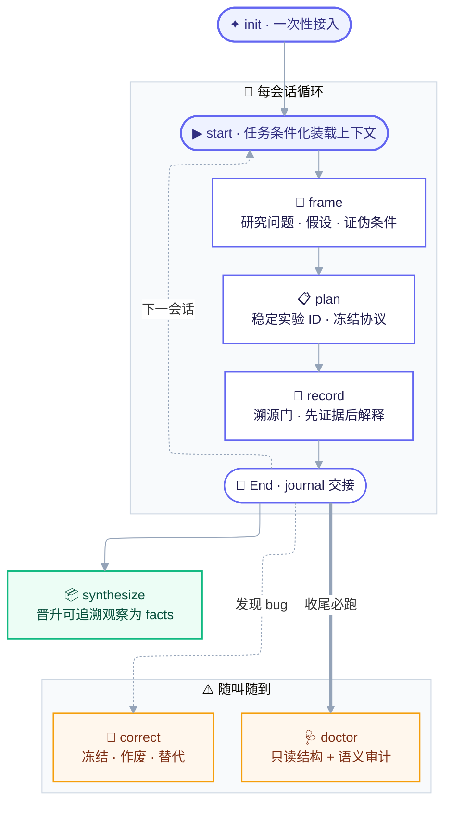
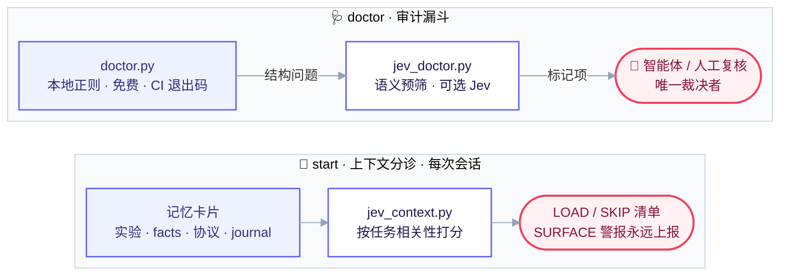

# Project Context V2

[English](README.md) | **简体中文**

面向 AI 编码智能体的证据优先长期实验记忆系统。每一条结论都保持"问题 → 证据"可追溯，每一次会话都能直接续作，不需要考古。

科研项目很少死于结果丢失——它们死于**上下文**丢失：那个数字是哪份配置跑出来的、为什么选这个基线、哪些结果已被作废、哪些只是假设。这个 skill 把 AI 智能体（Claude Code、ZCode 及任何兼容 skills 的智能体）变成一个守纪律的实验记录员：10 个操作、受控有效性词表、溯源门、只读审计。

## 工作原理



### 审计漏斗与上下文分诊

`doctor` 分层审计，`start` 只装载当前任务需要的内容。两个 Jev 层在未设置 `TYPESAFE_API_KEY` 时自动降级为完全离线可用。



## 操作一览

| 操作 | 用途 | 读/写 |
|---|---|---|
| `init` | 初始化记忆结构（只建缺失文件） | 写 |
| `start` | 续作：任务条件化上下文装载 + 现状报告 | 只读 |
| `frame` | 研究问题、假设、证伪条件、混杂因素 | 写（需确认） |
| `plan` | 注册实验：ID、冻结协议、验收标准 | 写 |
| `record` | 证据 + 溯源门 + 关键表 | 写 |
| `end` | journal 交接、刷新 CURRENT、跑 doctor | 写 |
| `correct` | 冻结旧记录、界定失效范围、链接替代 | 写 |
| `synthesize` | 晋升可追溯观察为持久 facts | 写 |
| `claim-audit` | claim–证据矩阵与支持度分类 | 只读 |
| `doctor` | 结构 + 可选语义健康审计 | 只读 |

## 安装

脚本需要 Python ≥ 3.10（零第三方依赖）。

```bash
# 通过 skills CLI 安装（项目级；加 -g 全局）
npx skills add poiuyjie/jev_project_context

# 或直接把仓库克隆进智能体的 skills 目录
git clone https://github.com/poiuyjie/jev_project_context ~/.agents/skills/project-context-v2
```

然后在你的科研项目里对智能体说：

> 为这个项目初始化科研记忆

日常使用：*"继续这个项目"*（start）、*"记录 E2026-0922-01 的结果"*（record）、*"结束会话"*（end）。

### 可选 Jev 层

配置 `TYPESAFE_API_KEY` 后两个脚本被激活，最简单的方式是 `.env` 文件：

```bash
cp .env.example .env   # 然后把 console.typesafe.ai/keys 申请的 key 粘贴进去
```

`jev_client.py` 会依次从当前目录、`scripts/` 目录、skill 根目录加载 `.env`——零依赖，且真实环境变量始终优先。`.env` 已被 git 忽略：切勿提交真实 key。

key 就位后（参见 [TypeSafe/Jev 文档](https://docs.typesafe.ai)）：

- `jev_context.py` — `start` 的任务条件化上下文分诊：一次批量决策调用，把实验记录、知识条目、协议、journal 按当前任务排序，输出字符预算内的 `LOAD / SKIP` 清单。相关性永远不掩盖过期：`SURFACE` 有效性警报（invalidated/superseded）即使对被跳过的条目也会输出。
- `jev_doctor.py` — `doctor` / `claim-audit` / `synthesize` 的语义预筛：溯源可恢复性、headline 与关键表一致性、解释混入观察、按受控词表做 claim 支持度分类。

两者均只读且仅作建议：输出是分诊线索，不是裁决。无 key（或 API 失败）时打印降级提示并以 0 退出——所有工作流完全离线可用。

## 记忆布局

```text
project/
├── AGENTS.md / CLAUDE.md    # 操作入口
├── CURRENT.md               # 权威现状投影
├── EXPERIMENTS.md           # 紧凑注册表与决定性表格
└── docs/
    ├── protocols/           # 版本化评估协议
    ├── research/            # 问题、假设、claims
    ├── knowledge/           # facts、bugs、决策、模式
    ├── experiments/         # 每个实验 ID 一份证据记录
    └── journal/             # 会话交接
```

各类文件的 schema：[references/schemas.md](references/schemas.md)。

## 核心原则

1. **证据比解释活得久。** 先记录观察后记录解释；纠错替换的是分析，永远不是记录本身。
2. **completed ≠ valid。** 执行状态和证据有效性是两个独立维度；新记录默认 `unchecked`。
3. **先溯源后分析。** 命令、解析后配置、代码版本、数据划分、seed、协议——无法恢复的字段标 `unknown`，绝不用当前默认值倒填。
4. **绝不静默改写历史。** 作废的结果保持可见并带警告，双向 `supersedes/superseded_by` 链接。
5. **审计只读。** `doctor` 和 `start` 永不修改文件；Jev 输出仅作参考。

## 许可证

[MIT](LICENSE)
